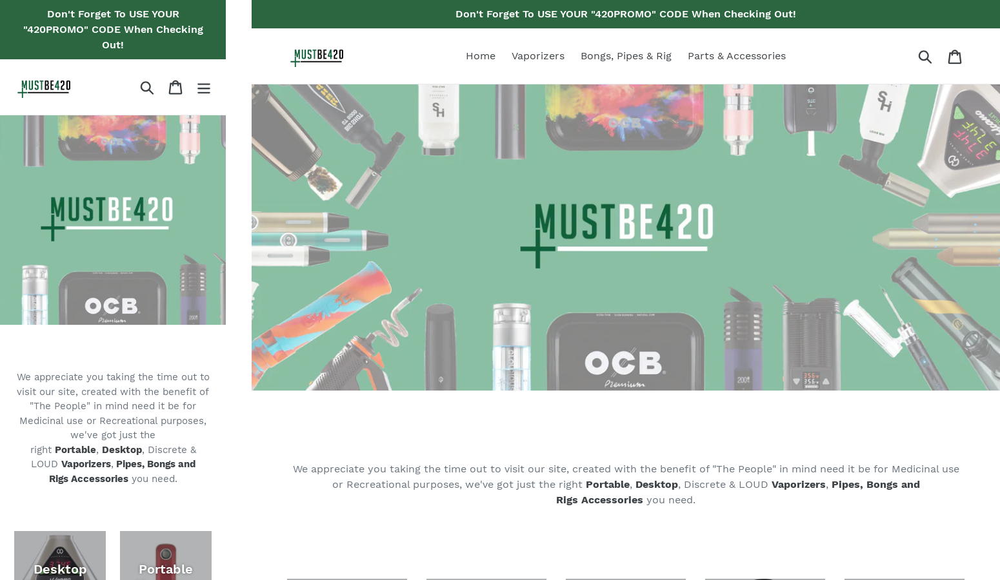

  
   

  <h3><b>MustBeFourTwenty Custom Theme</b></h3>

# 📗 Table of Contents

- [📗 Table of Contents](#-table-of-contents)
- [📖 About the Project](#about-project)
  - [🚀 Live Demo ](#-live-demo-)
  - [🛠 Built With ](#-built-with-)
    - [Tech Stack ](#tech-stack-)
    - [Key Features ](#key-features-)
  - [👥 Authors ](#-authors-)
    - [👤 Jerome](#-jerome)
  - [🔭 Future Features ](#-future-features-)
  - [🤝 Contributing ](#-contributing-)
  - [⭐️ Show your support ](#️-show-your-support-)
  - [📝 License ](#-license-)

  
   

# 📖 MB420 myshopify theme 

**MB420 myshopify theme** is a Custom Shopify Theme Template Built for The Branding and user experience of MustBe420.com/mustbefourtwenty.myshopify.com that will help promote a product first experience with it's eCommerce Interface Design

## 🚀 Live Demo 

- Front-end deployed website: [MustBe420 Live Demo](https://mustbefourtwenty.myshopify.com/)
-  **Password: WebDevJay**

(<a href="#readme-top">back to top</a>)

## 🛠 Built With 

- VScode
- Figma
- Shopify CLI

### Tech Stack 

- Ruby
- JavaScript
- Liquid
- Sass
- Css

<!-- Features -->

### Key Features 

- **Custom header**
- **Custom Nav Bar Position**
- **Customised for MustBeFourTwenty.com**

(<a href="#readme-top">back to top</a>)

## 👥 Authors 

### 👤 Jerome

- GitHub: [@githubhandle](https://github.com/187jjay187)
- Twitter: [@twitterhandle](https://twitter.com/187jjay187)
- LinkedIn: [LinkedIn](https://linkedin.com/in/jerome-osman-137605a4)

(<a href="#readme-top">back to top</a>)

## 🔭 Future Features 

- [ ] **More Products**
- [ ] **Theme Revamp**
- [ ] **B2B Intergration**

(<a href="#readme-top">back to top</a>)

## 🤝 Contributing 

Contributions, issues, and feature requests are welcome!

Feel free to check the [issues page](https://github.com/187jjay187/MB420-myshopify-theme/issues).

(<a href="#readme-top">back to top</a>)

## ⭐️ Show your support 

Give a ⭐️ if you like this project!

(<a href="#readme-top">back to top</a>)

## 📝 License 

This project is [LICENSE](./LICENSE.md) licensed.

(<a href="#readme-top">back to top</a>)

